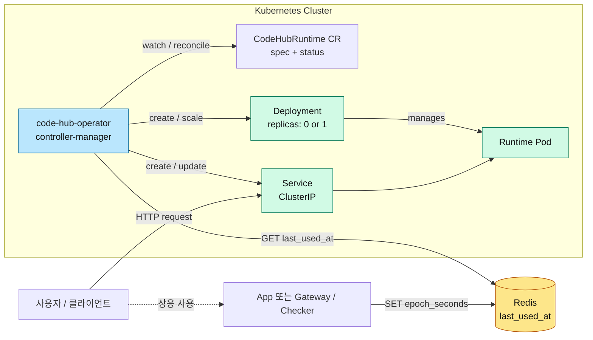
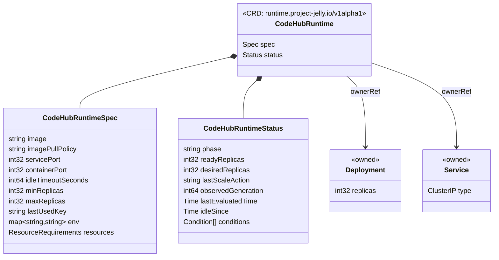
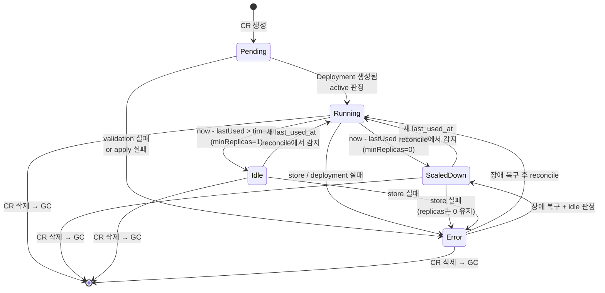
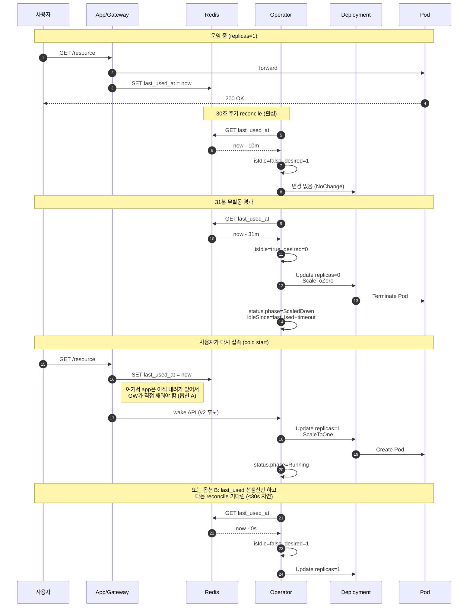
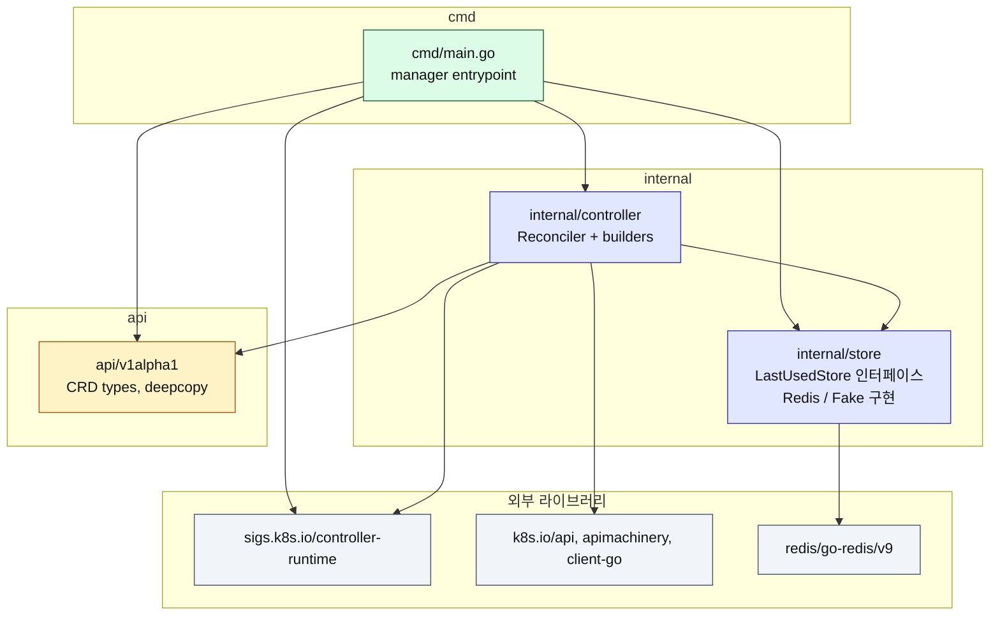
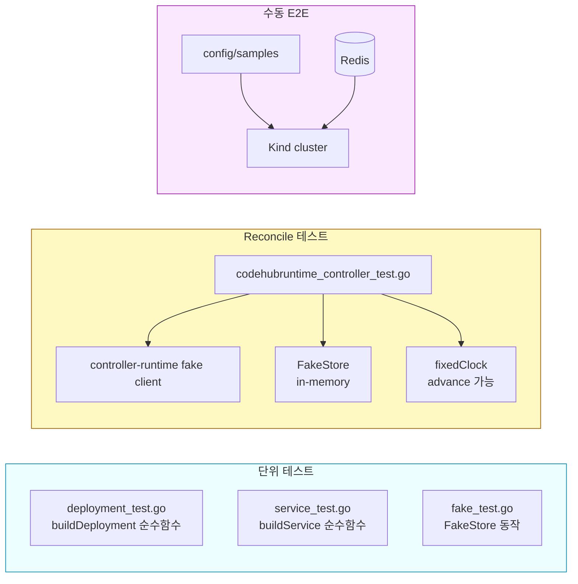

# Architecture — `code-hub-operator`

이 문서는 `code-hub-operator`의 v1alpha1 구조를 다이어그램 중심으로 설명한다. 상세 스펙은 `/root/.claude/plans/buzzing-yawning-truffle.md`(계획서)와 README를 함께 참고.

---

## 1. 시스템 전체 맥락

"누가 무엇을 바라보고, 누가 무엇을 바꾸는가"를 한눈에 본다.



**핵심 원칙**

- 오퍼레이터는 **사용 이력을 기록하지 않는다**. 그건 앱 또는 프록시 책임이다.
- 오퍼레이터는 Redis에서 값을 **읽기만** 한다. `now - last_used_at > idleTimeoutSeconds`면 idle.
- `Deployment`가 `replicas=1`이면 Pod가 죽어도 쿠버네티스가 다시 살린다. `replicas=0`이면 의도적 중지.

---

## 2. API 객체 구조

CR와 자식 리소스의 소유 관계. 삭제는 `ownerReferences`로 GC.



**Phase 값**: `Pending | Running | Idle | ScaledDown | Error`

**LastScaleAction 값**: `ScaleToOne | ScaleToZero | NoChange`

**Conditions**: `Ready`, `ExternalStoreReachable` (추후 `Idle`, `ScaledDown` 확장 예정)

---

## 3. Reconcile 흐름

`Reconcile()`의 결정 순서. 에러 경로에서도 **현재 replicas를 보존**하는 것이 원칙.

```mermaid
flowchart TD
    Start([Reconcile triggered]) --> Get{Get CR}
    Get -->|NotFound| Noop([noop - 종료])
    Get -->|Found| Validate{Validate<br/>spec}

    Validate -->|invalid| Err1[Phase=Error<br/>return ctrl.Result 빈 값<br/>requeue 없음]
    Validate -->|ok| EnsureSvc[ensureService]

    EnsureSvc -->|err| Err2[Phase=Error<br/>requeue 30s]
    EnsureSvc -->|ok| QueryStore[Store.Get<br/>lastUsedKey]

    QueryStore -->|err| StoreErrPath
    QueryStore -->|ok| Decide

    subgraph StoreErrPath[Store 에러 경로: replicas 보존]
        direction TB
        EnsurePreserve[ensureDeployment<br/>PreserveReplicas<br/>있으면 유지, 없으면 MaxReplicas로 생성]
        EnsurePreserve --> ObserveReady[observeReady]
        ObserveReady --> StoreErrStatus[Phase=Error<br/>ExternalStoreReachable=False<br/>requeue 30s]
    end

    subgraph Decide[정상 경로: idle 판정]
        direction TB
        CheckIdle{found 그리고<br/>now - lastUsed ><br/>idleTimeout?}
        CheckIdle -->|yes| IsIdle[desired = minReplicas]
        CheckIdle -->|no| IsActive[desired = maxReplicas<br/>Phase=Running]
        IsIdle --> PhaseDecide{desired == 0?}
        PhaseDecide -->|yes| PScaled[Phase=ScaledDown]
        PhaseDecide -->|no| PIdle[Phase=Idle]
    end

    Decide --> EnsureDep[ensureDeployment desired]
    EnsureDep -->|err| Err3[Phase=Error<br/>requeue 30s]
    EnsureDep -->|ok| WriteStatus[writeSuccessStatus<br/>Phase, desired, ready,<br/>lastScaleAction, idleSince,<br/>Conditions]
    WriteStatus --> Requeue([Result{RequeueAfter: 30s}])

    classDef errPath fill:#fecaca,stroke:#991b1b,color:#111;
    classDef okPath fill:#d1fae5,stroke:#047857,color:#111;
    class Err1,Err2,Err3,StoreErrStatus errPath;
    class WriteStatus,IsActive,IsIdle,PScaled,PIdle okPath;
```

**설계 결정 몇 가지**

- **last_used_at 값이 없으면 active로 간주**. 방금 만든 런타임이 첫 reconcile에 내려가는 것을 막기 위함.
- **Store 에러는 requeue만 한다**. 불확실한 상태에서 scale down 결정을 내리지 않는다.
- **Invalid spec은 requeue하지 않는다**. 사용자 실수를 타이트 루프로 재시도해도 의미 없음.
- **reconcile 주기**: 정상/에러 모두 30s. 이벤트 기반 watch로 CR/Deployment 변경은 즉시 반응.

---

## 4. Phase 상태 머신

CR가 겪는 상태 전이.



**주의**: `Error` 상태에서도 Deployment는 **의도적으로 건드리지 않는다**. 즉 "Error"는 관측 플래그지 동작 명령이 아니다. Store가 복구되면 다음 reconcile에서 자연스럽게 정상 phase로 돌아간다.

---

## 5. Scale Down / Scale Up 시퀀스

idle 자동 scale-down과 이후 재기동의 실제 순서.



**Cold start 전략 비교**

| 옵션 | 지연 | 복잡도 | 비고 |
|---|---|---|---|
| **A. Gateway가 Operator/wake API 직접 호출** | ≈ 수 초 | 높음 (wake API 필요) | v2 후보 |
| **B. last_used_at 갱신 후 다음 reconcile 대기** | ≤ `RequeueAfter` (30s) | 낮음 | **v1 기본** |

v1은 B를 기본으로 쓴다. 필요하면 운영자가 `kubectl patch`로 즉시 올릴 수도 있다.

---

## 6. 내부 패키지 구조

Go 모듈 레벨의 의존 방향. 바깥 쪽이 안쪽을 의존한다.



**의존 규칙**

- `api/v1alpha1`는 누구에게도 의존하지 않는다 (k8s 메타타입 제외).
- `internal/store`는 `internal/controller`에 의존하지 않는다. 반대 방향만 허용.
- `internal/controller`는 `cmd`에 의존하지 않는다.
- `cmd/main.go`가 유일한 조립 지점(composition root). Redis 주소 같은 환경 설정을 여기서만 읽는다.

---

## 7. 테스트 전략

의도: **외부 바이너리(envtest, Kind) 없이** 전체 reconcile 로직을 검증할 수 있어야 한다.



**분리 이유**

- **단위 + fake client 테스트**는 `go test ./...`만으로 돌아간다. CI에서 기본.
- **E2E는 수동**. 이유는 envtest 바이너리 의존을 깔끔히 피하기 위함이다. 필요해지면 `Makefile`에 `test-e2e` 타겟을 추가한다.
- **`fixedClock`** 덕분에 `sleep` 없이 "30분 지났다"를 시뮬레이션한다. 타이머 의존 테스트는 하나도 없다.

---

## 8. 보안 / 운영 메모

- 오퍼레이터 Pod는 **non-root + drop ALL capabilities + read-only root FS** 지향 (`config/manager/manager.yaml` 참고).
- **RBAC 최소화**: `runtime.project-jelly.io/codehubruntimes`, `apps/deployments`, `core/services`, `core/events`만. `secrets`, `configmaps`, `nodes`는 건드리지 않는다.
- Redis 연결정보는 **flag 또는 env**로만 주입. `ConfigMap`/`Secret` 예시는 추후 `config/manager/`에 추가 예정.
- CRD는 **cluster-scoped가 아닌 namespaced**로 고정. 멀티테넌트 운영 시 네임스페이스 경계와 일치시키기 위함.

---

## 9. 버전 로드맵

| 버전 | 스코프 |
|---|---|
| **v1alpha1 (현재)** | 0/1 replica, 단일 timeout, Redis, Deployment+Service |
| v1beta1 (후보) | finalizer, wake API, warm pool, multi-port, ingress 자동 생성 |
| v1 (안정화) | 단계형 scale, metrics exporter, OLM bundle, webhook validation |

버전 승격 시 CR의 기존 필드는 **stored version**으로 유지하고 변환 웹훅을 추가하는 정석 절차를 따른다.
